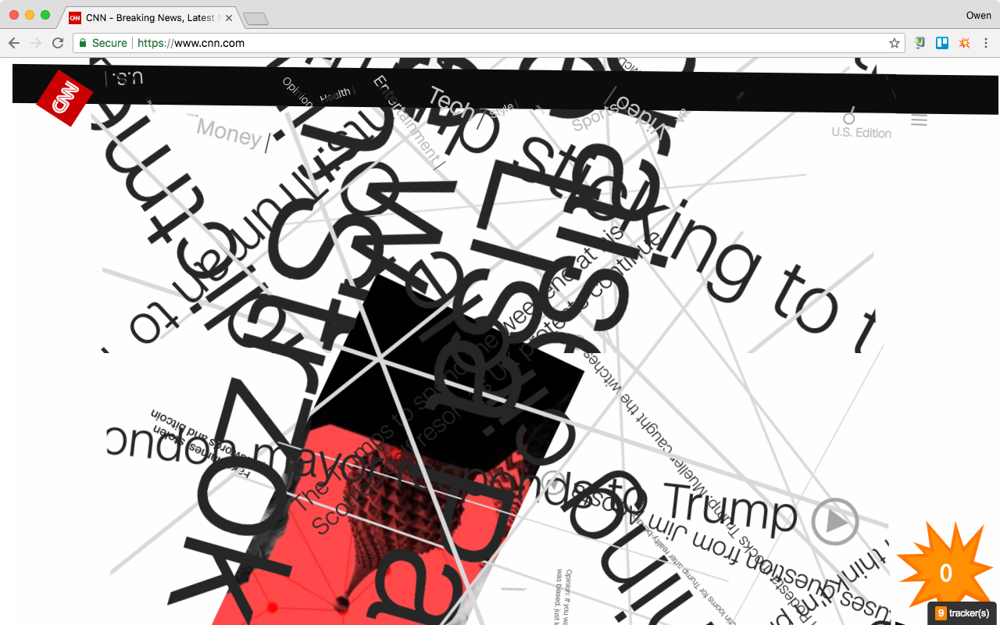

# Explode the Web!

Originally published as a chapter the tutorial has now been updated and improved:

- Install this browser extension ([Chrome](https://chrome.google.com/webstore/detail/explode-the-web/dmedbnfdhjfppcgbccpfaigicbnajhod) or [Firefox](https://addons.mozilla.org/addon/explode-the-web/)) to explode web pages with third party trackers.
- Read [Browser Blowup: Explode Web Pages Containing Third-Party Trackers](https://owenmundy.com/_site/content/_info/writing/sc_cookbook_2_browser_blowup.pdf) (2019).
- Follow the [new tutorial](tutorial/slides/0-introduction.html) to learn how to build your own browser extension.




## Browser Blowup Tutorial

- 0-Introduction [slides](tutorial/slides/0-introduction.html)
- 1-Hello world! [slides](tutorial/slides/1-hello-world.html)
- 2-Architecture and debugging [slides](tutorial/slides/2-archicture.html)
- 3-Working with the DOM [slides](tutorial/slides/3-dom.html)
- 4-Create the explosion [slides](tutorial/slides/4-explosion.html)
- 5-Examples [slides](tutorial/slides/5-examples.html)


## Credits

Dietrick, Joelle, Gretta Louw, and Owen Mundy. “[Browser Blowup: Explode Web Pages Containing Third-Party Trackers.](https://owenmundy.com/_site/content/_info/writing/sc_cookbook_2_browser_blowup.pdf)” In [Signal Culture Cookbook Vol.2](http://signalculture.org/cookbookvol2.html#.XvZmqJNKiL4), edited by Jason Bernagozzi, Vol. 2, 2019.


## To Do

- Add interaction instructions for console
- Finish part 4
- Align Marp setup with other projects


## Privacy Policy

This extension does not collect data.


## 3rd-party Libraries

This extension uses [Disconnect Tracking Services list](https://github.com/disconnectme/disconnect-tracking-protection) and the following libraries:

```
https://github.com/juliangarnier/anime/blob/3.2.0/lib/anime.min.js
https://github.com/jquery/jquery/releases/tag/3.6.0
https://github.com/cure53/DOMPurify/releases/tag/2.3.4
```
<small>^These are the official release URLs for Firefox Addon review</small>

