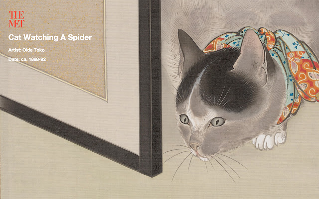

<!-- paginate: true -->

#  Explode the Web!

Make a browser extension to destroy web pages that steal your data.

<a href="../slides/0-introduction.html">slides</a> | <a href="../markdown/0-introduction.md">markdown</a> | <a href="../www/0-introduction.html">HTML</a>

<!--
Presentation comments ...
-->

---

## What you will learn

After this presentation you'll be able to:

1. Explain how browser extensions are used
1. Create a basic "hello world" example, and learn to debug extensions
1. How to work the DOM and add a Javascript library
1. Complete an extension to explode web pages with hidden data trackers.

---

## What is a Browser Extension?

- Browser extensions are software that add features to a web browser.
- Some are useful—the [Wayback Machine extension](https://chrome.google.com/webstore/detail/wayback-machine/fpnmgdkabkmnadcjpehmlllkndpkmiak/related?hl=en-US) shows you what a web page looked like in the past, even if it was deleted.

---

## What is a Browser Extension?

- Extensions can also be playful.
- [Meow Met](https://chrome.google.com/webstore/detail/meow-met/annljkgbhnihbghkbfammlacnlfkdclp?hl=en) displays a new random image from their collection that contains a cat when you open a new browser tab.

Emily McAllister, Metropolitan Museum of Art (2015)

---

## What is a Browser Extension?

- Ad blockers are some of the most popular extensions—removing annoying banner, popup, and video advertisements in real time<a href="https://adblockplus.org/en/getting_started#subscription">2</a>
- Similarly, tracker blockers prevent hidden trackers from collecting and monetizing your private searches, communications, and behaviors.

Ghostery, Disconnect, Privacy Badger, AdBlockPlus

---

## Building cross-browser extensions

In this tutorial

we'll start by setting up a basic "hello world" example
