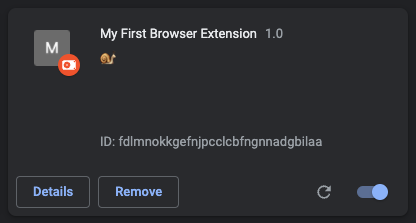

<!-- paginate: true -->

#  1- Hello World!

<span class="slides-small"><a href="../slides/1-hello-world.html">slides</a> | <span class="slides-small"><a href="../markdown/1-hello-world.md">markdown</a> | <a href="../www/1-hello-world.html">HTML</a></span>

<!--
Presentation comments ...
-->

1. HTML, CSS, and Javascript
1. Create manifest.json
1. Load an extension
1. Edit and refresh an extension
1. Content Scripts
1. Debug an extension


---

## HTML, CSS, Javascript

<div class="twocolumn">
<div class="col">

- Like all web pages, extensions are built using HTML, CSS, and Javascript code.
- [HTML](https://www.w3schools.com/html/default.asp) (HyperText Markup Language) structures content for the web.
- [CSS](https://www.w3schools.com/css/default.asp) (Cascading StyleSheets) control the presentation of content.
- [JS](https://www.w3schools.com/js/default.asp) (Javascript) is the programming language for web pages.
- This simple example will look like:
> <p>This is a <span style="color:red">paragraph</span></p>

</div>
<div class="col">

```html
<!-- hello.html -->
<html>
<head>
<title>Hello world!</title>
<link rel="stylesheet" href="styles.css">
<body>
<h1>Hello world!</h1>
<p>This is a paragraph</p>
<script src="main.js"></script>
</body>
</html>
```

```css
/* styles.css */
span { color: red; }
```

```js
// main.js
alert("This is a simple Javascript alert");
```

</div>
</div>


---

## 👉 Create the manifest file

The `manifest.json` file tells the browser how to install and run the extension code.

1. Create a new folder for your extension files and name it `explode-extension`
1. Create a new file named `manifest.json` inside the folder and paste the example.
1. Install the extension in your browser using the instructions below.

```json
{
	"name": "My First Browser Extension",
	"description": "🐌",
	"version": "1.0",
	"manifest_version": 3
}
```


---

## 👉 Install an extension for development


<div class="twocolumn">
<div class="col">

#### Chromium Browsers*

1. Go to `chrome://extensions`
1. Enable Developer mode by toggling the checkbox in the upper-right corner.
1. Click "Load unpacked" and select the folder with your extension manifest file.

</div>
<div class="col">

#### <a target="_blank" href="https://developer.mozilla.org/en-US/docs/Mozilla/Add-ons/WebExtensions/Your_first_WebExtension#installing">Mozilla Firefox</a>

1. Go to `about:debugging`.
1. Click "This Firefox".
1. Click "Load Temporary Add-on" and select any file in your extension folder.
1. The extension will remain installed until you restart Firefox.


</div>
</div>

<div class="slides-small caption">* We are building a "cross-browser extension" so, from this point instructions refer to Chromium browsers (Chrome, Brave, Opera, Edge, <a target="_blank" href="https://en.wikipedia.org/wiki/Chromium_(web_browser)#Browsers_based_on_Chromium">and others</a>), it will work fine in <a target="_blank" href="https://developer.mozilla.org/en-US/docs/Mozilla/Add-ons/WebExtensions">Firefox</a>.</div>


---

## 👉 Confirm the extension has loaded

<div class="twocolumn">
<div class="col">

1. Confirm your extension has loaded at `chrome://extensions`
1. Examine the panel for your extension to see the name, description, and version from your manifest file.
1. Notice also the enable|disable toggle and reload button.

</div>
<div class="col">



<div class="slides-small caption">Note that, "unpacked" simply means the folder and files have not yet been zipped to upload and distribute on Chrome or Firefox platforms.</div>

</div>
</div>


---

## About the tutorial

A few things to notice about this tutorial:

- The 👉 emoji lets you know there are steps to complete.
- You can find the finished extension files for each section of this tutorial in `tutorial/versions/` folder.
- We are using Manifest version 3, which is now required for all new published extensions.


---

## 👉 Edit and refresh an extension

These are the steps you will repeat to build and test an extension:

<div class="twocolumn">
<div class="col">

1. Edit and save the extension files in your code editor.
1. At `chrome://extensions` in your browser, click the small "refresh" button to reload extension.
1. Refresh a test page to run the extension on that page.

</div>
<div class="col">

```json
{
	"name": "Explode the Web! Tutorial",
	"description": "🐢",
	"version": "1.1",
	"manifest_version": 3
}
```

</div>
</div>


---

## How to debug an extension


1. Perhaps the most important thing besides proof your project is "working" is to be able to determine and debug when it is *not working*.


---

## TEMPLATE

<div class="twocolumn">
<div class="col">


</div>
<div class="col">


</div>
</div>
