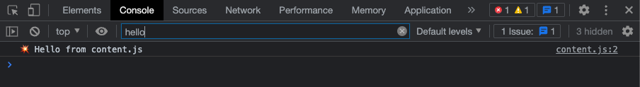

<!-- paginate: true -->

#  2-Archicture and debugging

<span class="slides-small"><a href="../slides/2-architecture.html">slides</a> | <span class="slides-small"><a href="../markdown/2-architecture.md">markdown</a> | <a href="../www/2-architecture.html">HTML</a></span>

<span class="slides-small">[⌂](../../README.md) | [0-Introduction](0-introduction.html) | [1-Hello World!](1-hello-world.html) | [2-Architecture](2-architecture.html) | [3-DOM](3-dom.html) | [4-Explosion](4-explosion.html)</span>

<!--
Presentation comments ...
-->

1. Extension architecture
1. Background Scripts
1. Content Scripts
1. Debug an extension


---

## Extension architecture


<div class="twocolumn">
<div class="col">

- The distinct "contexts" for scripts in an extension determine what your code can do and data it can access.
- This separation provides security, but increases complexity.
- Let's add the content and background files to the project and manifest.

</div>
<div class="col">


<div class="slides-small caption">Basic architecture and contexts of a browser extension. The file names and <a target="_blank" href="https://developer.chrome.com/docs/extensions/mv3/architecture-overview/">structure</a> is up to you.</div>

</div>
</div>


---

## Background service workers

<div class="twocolumn">
<div class="col">

- Background <a target="_blank" href="https://developer.chrome.com/docs/extensions/mv3/service_workers/">service workers</a> are loaded just once, during installation.
- Background scripts operate continuously, and they can use certain browser APIs like [localStorage](https://developer.mozilla.org/en-US/docs/Web/API/Window/localStorage) and connect to external APIs or databases.
- We aren't going to do much with the background, but in a second well see how it is important.

</div>
<div class="col">


👉 Add a new file `background.js` to the root of your project folder and paste this code.

```js
// background.js
console.log("💥 Hello from background.js");
```

<div class="slides-small caption">The "root" means directly to `explode-tutorial` folder so the path = `explode-tutorial/background.js`.</div>

</div>
</div>


---

## Content scripts

<div class="twocolumn">
<div class="col">

- <a target="_blank" href="https://developer.chrome.com/docs/extensions/mv3/content_scripts/">Content scripts</a> run inside web pages that users visit.
- They are loaded ("injected") into *each* page a user visits, so can access web page content or listen for user events (the same as other scripts on a page).
- A content script's activity is limited to the current page, but they can send and receive data from the background via [messages](https://developer.mozilla.org/en-US/docs/Mozilla/Add-ons/WebExtensions/Content_scripts#communicating_with_background_scripts).

</div>
<div class="col">

👉 Add a new file `content.js` to the root of your project and paste this code.

```js
// content.js
console.log("💥 Hello from content.js");
```

</div>
</div>


---

## Check the manifest

<div class="twocolumn">
<div class="col">

- 👉 Update `manifest.json` to reference the new files.
- Manifest files use JSON, which has a strict syntax. If you have issues then try checking your manifest code using [jsonlint.com](https://jsonlint.com/).
- Refresh your extension at `chrome://extensions` and go to any page. For example: <a target="_blank" href="https://www.eff.org">eff.org</a>

</div>
<div class="col">

```json
{
	"name": "Explode the Web! Tutorial",
    "description": "🦆",
    "version": "1.2.0",
    "manifest_version": 3,

    "background": {
        "service_worker": "background.js"
    },

    "content_scripts": [{
        "matches": ["<all_urls>"],
        "js": ["content.js"]
    }]
}
```

<div class="slides-small caption">Your `manifest.json` file should now look like this.</div>

</div>
</div>


---

## 👉 Debug an extension content script


Besides proof your project is "working", it is important to be able to see information when it is ***not working***.

1. On the previous test link, right-click any element on the page and select **Inspect** to open a <a target="_blank" href="https://developer.chrome.com/docs/devtools/open/">DevTools</a> panel like the one below.
1. Click on **Console** to confirm you can see your message.




---

## 👉 Debug an extension background script


The content script is injected into each page, so you can see console messages in the regular DevTools.

1. To open a new DevTools panel for just the background, go to `chrome://extensions` and click on "Inspect views service worker".
1. Click on **Console** and confirm you can see your message.


---

## Part 2 conclusion

- We added background and content scripts, updated the manifest, and learned how to inspect an extension in Chrome.
- 👉 Start the next section [Document Object Model](3-dom.html)
