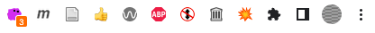

<!-- paginate: true -->

#  3-DOM

<span class="slides-small"><a href="../slides/3-dom.html">slides</a> | <span class="slides-small"><a href="../markdown/3-dom">markdown</a> | <a href="../www/3-dom.html">HTML</a></span>

<span class="slides-small">[⌂](../../README.md) | [0-Introduction](0-introduction.html) | [1-Hello World!](1-hello-world.html) | [2-Architecture](2-architecture.html) | [3-DOM](3-dom.html) | [4-Explosion](4-explosion.html)</span>

<!--
Presentation comments ...
-->

1. Download and add project assets
1. Add a browser action and icons
1. Test the explosion script


---

## 👉 Get project assets

<div class="twocolumn">
<div class="col">

1. Download the [`assets.zip`](https://github.com/sneakaway-studio/explode-the-web/tree/main/extension) file you'll need to continue the tutorial.
1. Unzip the folder and place it in your `explode-tutorial` project folder.
1. Your structure should look like this >

</div>
<div class="col">

```
/explode-tutorial/
    assets/
        css/
        img/
        libs/
        js/
        pages/
        sounds/
    background.js
    content.js
    manifest.json
```

</div>
</div>


---

## Browser action

<div class="twocolumn">
<div class="col">

- An [action](https://developer.chrome.com/docs/extensions/reference/action/) adds an extension icon and popup window to the browser toolbar.
- The action is sometimes called "browser action", or "popup script".
- The action popup is an HTML page you define and has its own context (and its own DevTools console!).

</div>
<div class="col">


</div>
</div>


---

## 👉 Add an action

<div class="twocolumn">
<div class="col">

1. Add a new file to the project folder called `action.html`
1. Paste in this code.

</div>
<div class="col">

```html
<!DOCTYPE html>
<html>
<head>
<meta charset="UTF-8">
</head>
<body>
<div style="width:220px; text-align:center">
<p>💥 Explode Tracked Pages!</p>
<p>Press e + ~ to test</p>
</div>
</body>
</html>
```


</div>
</div>


---

## 👉 Add the action and icons to the manifest

<div class="twocolumn">
<div class="col">

- The icon identifies the browser extension in the `chrome://extensions` page.
- Add this code to your manifest to add the icon and action and refresh the extension.

</div>
<div class="col">

```json
"icons": {
    "16": "assets/img/explosion-icon16.png",
    "32": "assets/img/explosion-icon32.png",
    "64": "assets/img/explosion-icon64.png",
    "128": "assets/img/explosion-icon128.png"
},

"action": {
    "default_icon": {
        "16": "assets/img/explosion-icon16.png",
        "32": "assets/img/explosion-icon32.png"
    },
    "default_title": "Explode Tracked Web Pages!",
    "default_popup": "action.html"
},
```

</div>
</div>


---

## 👉 Add libraries to manifest

<div class="twocolumn">
<div class="col">

- Let's go ahead and reference the libraries we need in our manifest.
- Edit the `content_script` section, and add `web_accessible_resources` to the end. Refer to the <a target="_blank" href="https://developer.chrome.com/docs/extensions/reference/">documentation</a> for details.
- If you prefer to copy and paste you can get the full <a target="_blank" href="https://github.com/sneakaway-studio/explode-the-web/blob/main/extension/explode-tutorial-3/manifest.json">`manifest.json`</a> on Github.

</div>
<div class="col">

```json
"content_scripts": [{
    "matches": ["<all_urls>"],
    "js": [
        "assets/libs/anime.min-3.2.0.js",
        "assets/libs/jquery-3.6.0.min.js",
        "assets/libs/purify-2.3.4.js",
        "assets/js/disconnect-tracking-services.js",
        "assets/js/functions.js",
        "assets/js/keys.js",
        "assets/js/explode.js",
        "content.js"
    ],
    "css": [
        "assets/css/styles.css"
    ],
    "run_at": "document_end",
    "all_frames": true
}],

"web_accessible_resources": [{
    "resources": ["*.svg", "*.mp3"],
    "matches": ["<all_urls>"],
    "use_dynamic_url": true
}]
```

</div>
</div>


---

## 👉 Test the explosion



- Refresh your extension and click the action icon to see the popup (you may need to click the puzzle piece).
- If everything worked you'll see a line that says `Press e + ~ to test`. Before you do that, know that you just need to refresh the page to reset everything.


---

## Explode the Web!

I don't know about you but I enjoy this small function immensely. The code that makes this work is not extension-specific, it's just Javascript. I'll say two things about it:

- The animation is made possible thanks to <a target="_blank" href="https://animejs.com/">Anime.js</a> library. I highly recommend exploring the examples in the documentation.
- I wrote the <a target="_blank" href="https://github.com/sneakaway-studio/explode-the-web/blob/main/extension/explode-tutorial-final/assets/js/explode.js">code</a> that explodes the page. It is open source, and is fairly simple: grabbing all the html elements on a page, and transforming their position, rotation, and scale using select random numbers.


---

## Part 3 conclusion

- We made a lot of progress, adding assets with icons, a test page, and

- 👉 Start the next section [Create the Explosion](4-explosion.html)
